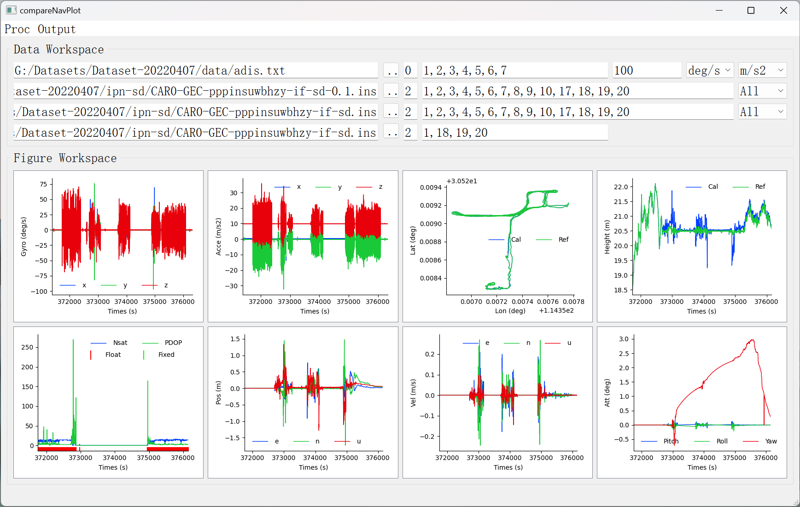
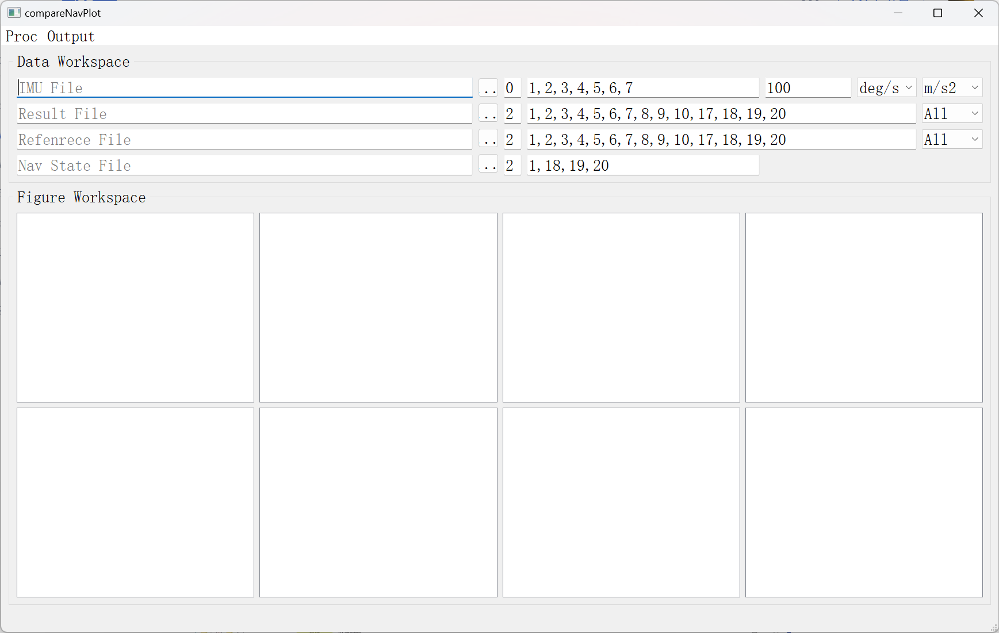

# compareNavPlot
**PySide2 UI for plotting IMU outputs, GNSS or GNSS/INS positioning results**

---

**Overview**

---

compareNavPlot.py --- plot control code

compareNavPlot.ui --- plot ui settings

glv.py --- global variables

tool_func.py --- significant functions for error comparision

